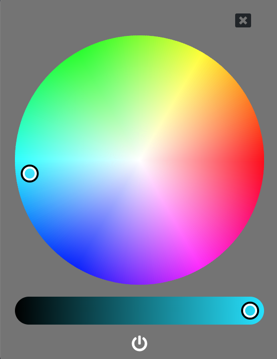

# LIFX Color Menu

Add a convenient color picker for controlling your LIFX lights to your Mac menu bar or your Windows system tray.

## Installation

Clone this repository.

    git clone https://github.com/lpdrummerboy87/lifx-menu.git

Build and compile the application.

    npm run build

The app will be output to the `build` directory.

Copy the app to your Mac `Applications` directory.

You can also run the application directly from the command line.

    npm start

## Contributing
Pull requests are welcome. For major changes, please open an issue first to discuss what you would like to change.

## License
[MIT](https://choosealicense.com/licenses/mit/)
